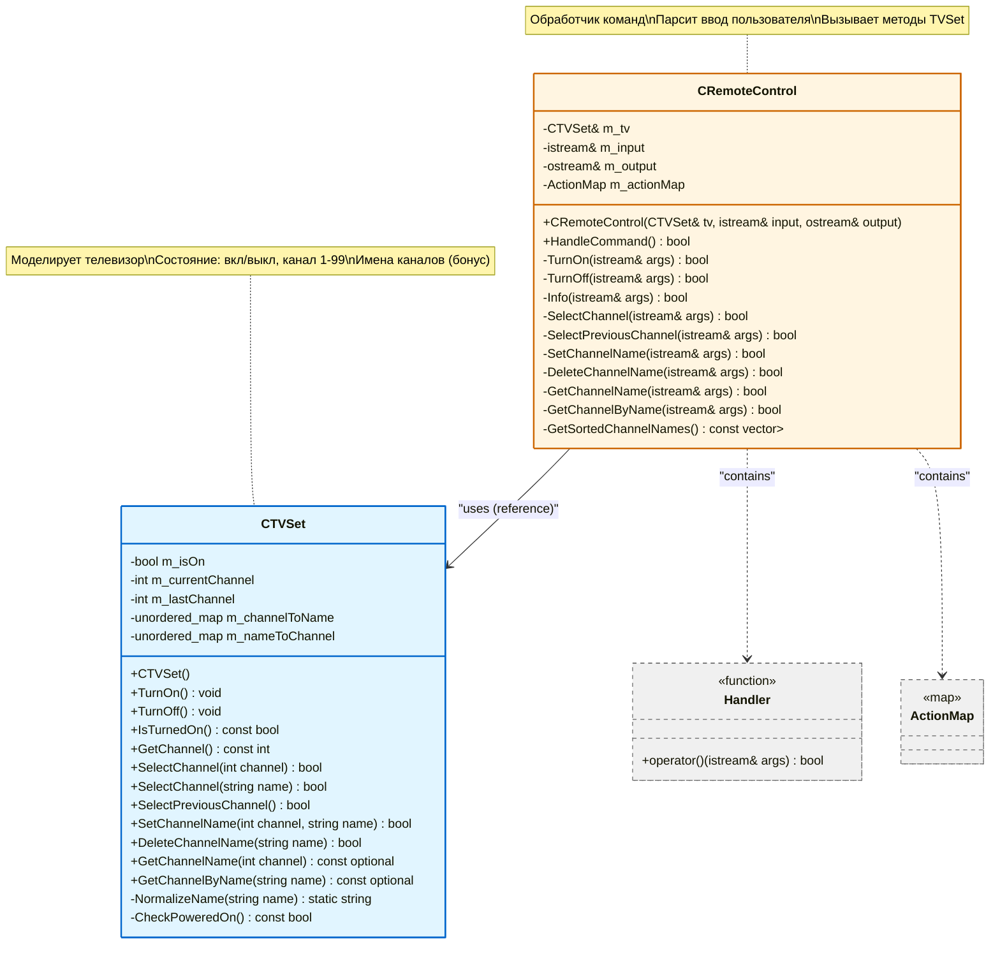

```mermaid
classDiagram
    %% ==================== CTVSet ====================
    class CTVSet {
        -bool m_isOn
        -int m_currentChannel
        -int m_lastChannel
        -unordered_map<int, string> m_channelToName
        -unordered_map<string, int> m_nameToChannel
        
        +CTVSet()
        +TurnOn() void
        +TurnOff() void
        +IsTurnedOn() const bool
        +GetChannel() const int
        +SelectChannel(int channel) bool
        +SelectChannel(string name) bool
        +SelectPreviousChannel() bool
        +SetChannelName(int channel, string name) bool
        +DeleteChannelName(string name) bool
        +GetChannelName(int channel) const optional<string>
        +GetChannelByName(string name) const optional<int>
        -NormalizeName(string name) static string
        -CheckPoweredOn() const bool
    }
    
    %% ==================== CRemoteControl ====================
    class CRemoteControl {
        -CTVSet& m_tv
        -istream& m_input
        -ostream& m_output
        -ActionMap m_actionMap
        
        +CRemoteControl(CTVSet& tv, istream& input, ostream& output)
        +HandleCommand() bool
        -TurnOn(istream& args) bool
        -TurnOff(istream& args) bool
        -Info(istream& args) bool
        -SelectChannel(istream& args) bool
        -SelectPreviousChannel(istream& args) bool
        -SetChannelName(istream& args) bool
        -DeleteChannelName(istream& args) bool
        -GetChannelName(istream& args) bool
        -GetChannelByName(istream& args) bool
        -GetSortedChannelNames() const vector<pair<int, string>>
    }
    
    %% ==================== Handler Types ====================
    class Handler {
        <<function>>
        +operator()(istream& args) bool
    }
    
    class ActionMap {
        <<map<string, Handler>>
    }
    
    %% ==================== Relationships ====================
    CRemoteControl --> CTVSet : "uses (reference)"
    CRemoteControl ..> Handler : "contains"
    CRemoteControl ..> ActionMap : "contains"
    
    %% ==================== Notes ====================
    note for CTVSet "Моделирует телевизор\nСостояние: вкл/выкл, канал 1-99\nИмена каналов (бонус)"
    note for CRemoteControl "Обработчик команд\nПарсит ввод пользователя\nВызывает методы TVSet"
    
    %% ==================== Styling ====================
    style CTVSet fill:#e1f5ff,stroke:#0066cc,stroke-width:2px
    style CRemoteControl fill:#fff5e1,stroke:#cc6600,stroke-width:2px
    style Handler fill:#f0f0f0,stroke:#666666,stroke-width:1px,stroke-dasharray: 5 5
    style ActionMap fill:#f0f0f0,stroke:#666666,stroke-width:1px,stroke-dasharray: 5 5
```